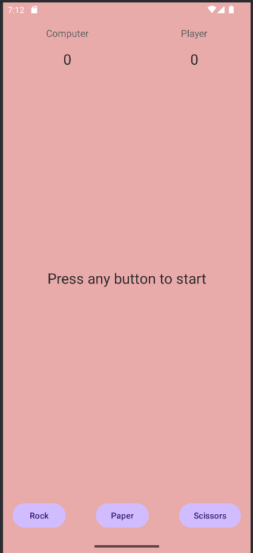
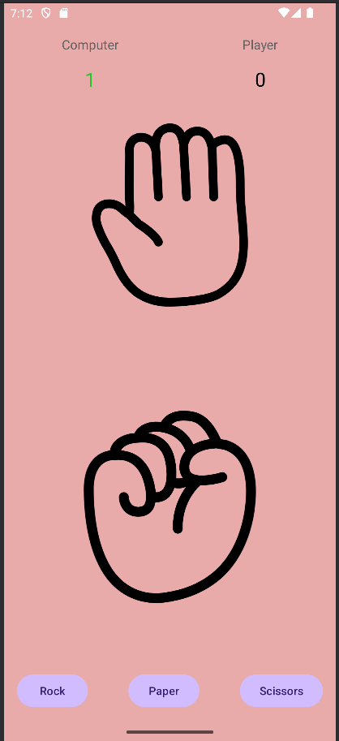
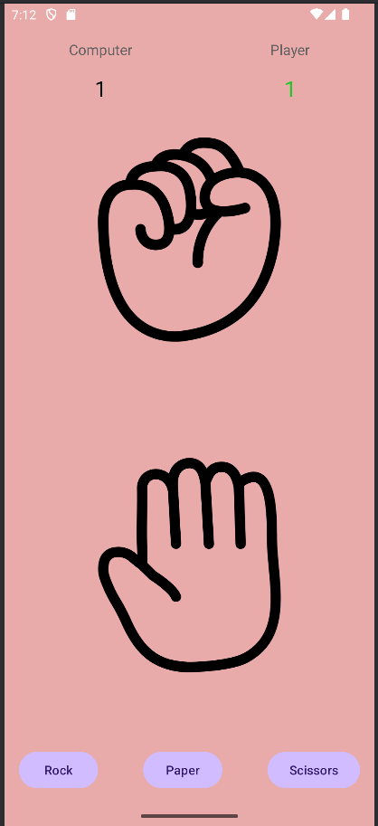
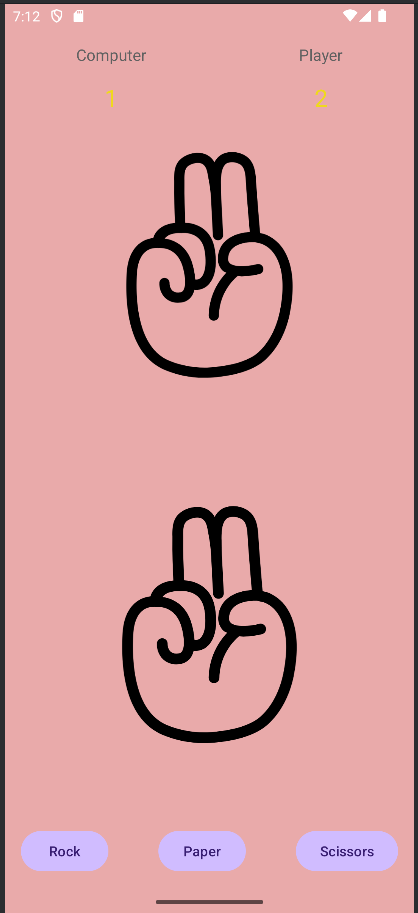

# ✊✋✌️ Rock Paper Scissors Game

A simple and intuitive mobile Rock Paper Scissors game built using **Android** and **Kotlin**. Test your luck and reflexes against the computer with a minimalist and responsive UI.

## 🎮 Features

- 🖐️ Intuitive gesture icons for Rock, Paper, and Scissors
- 📈 Real-time score tracking for both player and computer
- ⚡ One-tap gameplay with instant feedback
- 🎨 Clean, modern design with engaging visuals
- 🧠 Classic game logic:
    - Rock crushes Scissors
    - Scissors cuts Paper
    - Paper covers Rock

## 📸 Screenshots

| Game Interface                                       |
|------------------------------------------------------|
|  |
|  |
|  |
|  |

## 🔧 Tech Stack

- **Language**: Kotlin
- **IDE**: Android Studio
- **UI**: ViewBinding + ConstraintLayout
- **Animations**: Basic gesture animations

## 🛠️ Build Configuration

```groovy
compileSdk = 34
minSdk = 24
targetSdk = 34
jvmTarget = "11"
viewBinding = true
